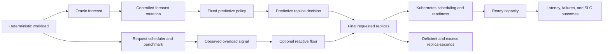

# Forecast-Error Semantics in Predictive Kubernetes Autoscaling

[](https://github.com/anfa-majid/forecast-error-semantics-kubernetes-autoscaling/releases/tag/v1.0.1)
[](LICENSE)
[](LICENSE-DATA)

This repository is the reproducibility artifact for the empirical study
*When Equal Forecast Error Is Not Operationally Equal: A Controlled Study of
Predictive Kubernetes Autoscaling*.

The study examines a practical limitation of aggregate forecast-accuracy
metrics. Two workload forecasts can have the same mean absolute error (MAE) and
root mean squared error (RMSE), yet lead a predictive autoscaler to request
different replica counts at different times. Kubernetes readiness delay can
then turn those decision differences into materially different tail latency,
SLO violations, capacity deficiency, or resource occupancy.

The artifact contains the Go benchmark and controller implementations,
Kubernetes manifests, deterministic workload and forecast traces, the frozen
experimental protocol, the analysis-ready dataset, statistical programs,
reference results, and an audited local-cluster example.

> **Current artifact boundary.** The processed 142-run dataset and all inputs
> needed to reconstruct the reported statistical tables and figures are
> included. The complete multi-gigabyte raw campaign archive is not included in
> this compact repository. Consequently, the artifact supports exact analysis
> reproduction and a fresh functional Kubernetes run, but not independent
> reprocessing of all 142 raw runs until that archive is deposited separately.

## Research problem

Predictive autoscaling is a forecast-to-decision system, not only a forecasting
task. A workload forecast is mapped through discrete replica-capacity
boundaries; the requested replicas must then be scheduled and become Ready
before they can serve traffic. Aggregate error metrics discard error sign,
event identity, temporal placement, and lead time even though these properties
can determine whether the same error magnitude creates service harm or unused
capacity.

The controlled study therefore asks:

1. **Main question:** When workload forecasts have similar conventional
   accuracy, why do they produce different Kubernetes scaling decisions, SLO
   violations, and resource costs?
2. **Primary question:** When MAE and RMSE are held approximately constant, how
   do error direction, timing, duration, shape, and transition location affect
   scaling decisions, capacity readiness, tail-latency SLOs, and resource
   waste?
3. **Secondary question:** How does a fixed reactive safety mechanism change
   the operational impact of different forecast-error structures?

## Contributions

The study and artifact provide:

- a forecast-error taxonomy covering direction, duration, event presence,
  timing, placement relative to transitions, and shape;
- deterministic mutation and matching procedures for constructing controlled
  forecast pairs with equal or approximately equal conventional accuracy;
- end-to-end measurements connecting forecast error to predictive decisions,
  requested replicas, Ready capacity, request outcomes, and resource proxies;
- a matched safety-off/safety-on ablation for two underprediction errors;
- exact paired randomization tests, paired bootstrap intervals, multiplicity
  adjustment, interaction analysis, and supplementary ranking analysis; and
- a version-pinned artifact with five reproduction levels, validation scripts,
  immutable reference outputs, and an audited disposable-cluster example.

## Causal framework

The experimental manipulation is the forecast mutation. Workload, controller
policy, empirical capacity lookup, cluster configuration, run protocol, and
paired repetition are held fixed within each controlled comparison.



This design supports causal statements only for the prespecified matched
contrasts under the tested system. Correlations between metric rankings are
reported as supplementary associations, not causal effects.

## Experimental design at a glance

| Element | Frozen design |
|---|---|
| Original cluster | Three amd64 Azure nodes; Ubuntu 24.04.4 LTS; K3s `v1.36.1+k3s1`; containerd `2.2.3-k3s1`. |
| Application | Instrumented Go HTTP service performing deterministic CPU work, with liveness, readiness, and Prometheus endpoints. |
| Workloads | Five deterministic workload families covering stable, gradual, sustained-peak, periodic, and narrow-spike behavior. |
| Predictive policy | One-second decisions using the forecast at `t + 6 s`; 30-second predictive scale-down stabilization. |
| Capacity lookup | 1, 2, 3, and 4 replicas mapped to 30, 40, 55, and 65 requests/s. |
| Primary contrasts | Seven accuracy-matched A/B comparisons covering direction, duration, event presence, placement, shape, and timing in two workload contexts. |
| Primary repetition | Eight matched repetitions per condition side: 112 contrast runs. |
| Reference runs | 20 oracle-reference runs. |
| Safety ablation | Persistent negative bias and missed peak; five matched safety-off/safety-on repetitions per error. The ten safety-off comparators are primary runs, and ten additional safety-on runs are included. |
| Analysis population | 142 accepted runs and 59,400 aligned run-seconds. The run, not the second or event, is the inferential unit. |
| Inference | Exact paired sign-flip tests, 20,000-resample paired bootstrap intervals, paired effect sizes, Holm adjustment, interaction contrasts, and supplementary rank comparisons. |

The complete protocol is documented in
[`experiments/protocol/`](experiments/protocol/), and the measurement
definitions are in
[`processing/DATA-DICTIONARY.md`](processing/DATA-DICTIONARY.md).

## Principal findings

The values below are prespecified paired differences across eight matched
primary repetitions unless stated otherwise. They describe this fixed
application, policy, capacity profile, workload suite, and cluster; they are
not universal effect estimates.

| Controlled comparison | Accuracy control | Operational result | Mechanism supported by the traces |
|---|---|---|---|
| Persistent negative vs. positive 5 requests/s bias | Equal MAE, RMSE, and transition MAE | Negative bias caused 211 deficient replica-seconds. Positive bias matched the oracle decision trajectory and created no oracle-relative excess. Relative to negative bias, positive bias reduced request P99 by 12.86 ms and composite-SLO duration by 8.25 s. | Equal-magnitude errors fell on opposite sides of the three-to-four-replica decision boundary at the sustained 60 requests/s peak. |
| Shortened vs. extended sustained peak | Equal MAE and RMSE | Shortening added 90 deficient replica-seconds and 1,543.79 ms request P99; extension added 90 excess replica-seconds. | Ending the predicted event early removed capacity while demand remained; extending it retained capacity after demand fell. |
| Missed vs. false narrow spike | Equal MAE and RMSE | Missing the real spike added 180 deficient replica-seconds, 4,805.43 ms request P99, and 49.25 composite-SLO seconds; the false spike added 120 excess replica-seconds instead. | Event omission prevented scale-out for real demand, whereas a false event provisioned unused capacity without causing a shortage. |
| Late vs. early narrow-spike forecast | Equal MAE, RMSE, desired-replica MAE, and aggregate deficient/excess replica-seconds | Lateness added 2,565.51 ms request P99 and 8.625 composite-SLO seconds. | The late scale-out left insufficient time for Pods to become Ready before the short spike. |
| Sharpened vs. smoothed periodic forecast | Equal MAE, RMSE, and transition MAE | Both forecasts produced identical controller decisions and capacity outcomes; no reproducible reliability difference was observed. | Structural difference alone was insufficient when both forecasts remained in the same replica-decision regions. |

These results show that error structure mattered when it activated a discrete
decision boundary, changed whether capacity was absent or retained, or altered
readiness lead time. They do **not** show that every structural difference must
matter: the shape contrast and the periodic timing contrast are important null
cases.

Detailed effect estimates, uncertainty intervals, pair consistency, adjusted
p-values, robustness checks, and negative findings are available in the
[`detailed research report`](docs/study-synthesis/STEP-20-DETAILED-RESEARCH-REPORT.md)
and the nine auditable
[`evidence ledgers`](docs/study-synthesis/evidence-ledger/).

## Reactive safety-net findings

The tested safety rule raised a reactive replica floor after two consecutive
observed overload windows. It was evaluated only for a missed peak and a
persistent negative bias, with five matched safety-off/safety-on pairs per
error.

| Underprediction error | Deficient replica-seconds | Request P99 | Composite-SLO duration | Oracle-relative excess introduced |
|---|---:|---:|---:|---:|
| Missed peak | 180 to 21 (`-88.3%`) | 5,197.66 to 2,697.31 ms (`-48.1%`) | 60 to 15 s (`-75.0%`) | 15 replica-seconds |
| Persistent negative bias | 211 to 7 (`-96.7%`) | 48.72 to 33.03 ms (`-32.2%`) | 26.4 to 17.2 s (`-34.8%`) | 17 replica-seconds |

The safety net reduced rather than eliminated harm because overload detection
and Pod readiness both took time. Its protection also consumed additional
capacity. With only five pairs, the minimum possible two-sided exact p-value
was 0.0625; these safety effects must therefore not be described as
conventionally statistically significant. The persistent-bias SLO response was
heterogeneous and worsened in one repetition.

No direct safety conclusion is supported for error duration, early/late
timing, stable/transition placement, shape, false peaks, or overprediction.

## What conventional metrics did and did not capture

MAE and RMSE were informative but incomplete. Across the 14 primary condition
medians, they were associated with desired-replica error, but they could not
distinguish the operational outcomes inside the deliberately accuracy-matched
pairs. Forecast and service rankings were not interchangeable: RMSE versus
composite-SLO duration had Spearman correlation `-0.573` and `72.9%` pairwise
ranking disagreement. Request P99 versus composite-SLO duration had Spearman
correlation `-0.319` and `61.5%` disagreement.

These ranking results are descriptive and dataset-specific. They motivate
reporting decision, readiness, reliability, and resource measures alongside
forecast error; they do not establish a universal ranking of metrics.

## Reproducibility levels

Choose the level that matches the claim you want to check.

| Level | Requirement | What it verifies |
|---|---|---|
| **A: analysis** | Python | Recreates the statistical tables and all six analysis figures from 142 accepted runs. |
| **B: deterministic inputs** | Python plus Pillow | Regenerates the workloads, oracle decisions, 122 mutation artifacts, and 239 matching artifacts byte-for-byte. |
| **C: implementation** | Go or Docker | Runs controller and application tests and builds the pinned images. |
| **D: functional experiment** | Docker, kind, kubectl, Helm, and PowerShell 7 | Deploys the system and executes one workload/forecast replay on a disposable local cluster. |
| **E: direct campaign replication** | A dedicated three-node K3s environment | Repeats the frozen primary and safety matrices after validating a new environment's capacity and readiness profile. |

Levels A--C are offline and do not modify a cluster. Levels D--E create or
modify Kubernetes resources and generate load. Review the target context before
running either level.

## Quick start: reproduce every paper figure

### Requirements

- Python 3.12 (the audited environment used Python 3.12.13);
- approximately 100 MB of free disk space; and
- PowerShell 7 for the one-command Windows path.

The Python package versions are pinned in [`requirements.txt`](requirements.txt)
and all relevant environment versions are recorded in
[`versions.lock.yml`](versions.lock.yml).

### Windows PowerShell 7

```powershell
git clone https://github.com/anfa-majid/forecast-error-semantics-kubernetes-autoscaling.git
Set-Location .\forecast-error-semantics-kubernetes-autoscaling
python -m venv .venv
& .\.venv\Scripts\Activate.ps1
python -m pip install --upgrade pip
python -m pip install -r requirements.txt
& .\scripts\reproduce-figures.ps1
```

### Linux or macOS

```bash
git clone https://github.com/anfa-majid/forecast-error-semantics-kubernetes-autoscaling.git
cd forecast-error-semantics-kubernetes-autoscaling
python3.12 -m venv .venv
source .venv/bin/activate
python -m pip install --upgrade pip
python -m pip install -r requirements.txt

python analysis/tools/analyze_step18.py \
  --run-level data/processed/run-level.csv \
  --output-directory results/reproduced/step18/output

python analysis/tools/create_step18_figures.py \
  --analysis-directory results/reproduced/step18/output \
  --output-directory results/reproduced/step18/figures

python analysis/tools/validate_step18.py \
  --dataset-directory results/reproduced/step18/output \
  --figures-directory results/reproduced/step18/figures
```

### Expected result

A successful run creates:

- six SVG figures in `results/reproduced/step18/figures/`;
- reconstructed statistical tables in
  `results/reproduced/step18/output/`; and
- a validation result confirming `12/12 byte-identical reference artifacts`.

The immutable comparison targets are under
[`results/reference/statistical/`](results/reference/statistical/).

## Verify deterministic inputs and the offline artifact

Run the deterministic workload, oracle, mutation, and matching checks:

```powershell
& .\scripts\verify-deterministic-inputs.ps1
```

Run the offline test and data-validation suite:

```powershell
& .\scripts\run-offline-tests.ps1
```

Run the repository-wide release verification:

```powershell
& .\scripts\verify-checksums.ps1
& .\scripts\verify-artifact.ps1 -RunOfflineTests
```

Go 1.24.6 is optional for the standard offline suite because the Dockerfiles
pin the Go toolchain. Use `-RequireGo` with the artifact verifier when
certifying a release on a host with that Go version installed.

## Run the functional Kubernetes example

> **Safety warning:** These scripts create a three-node kind cluster, build and
> import local images, deploy resources, change replica counts, open local port
> forwards, and generate load. Use the disposable kind context created by the
> setup script. Do not run them against a production cluster.

Prerequisites are Docker, kind 0.32.0, kubectl, Helm, PowerShell 7, and enough
resources for a three-node local cluster. After starting Docker:

```powershell
kubectl config current-context
& .\scripts\setup-kind.ps1
kubectl --context kind-forecast-error-artifact get nodes
& .\scripts\run-example.ps1
```

The workload replay itself lasts 180 seconds; image builds and cluster setup
add environment-dependent time. Success is determined by a generated
`example-run-validation.json` containing `"valid": true`, not merely by the
wrapper process exiting.

The commissioned validation run scheduled 5,550 requests, recorded 5,550
successful responses with no request errors or timeouts, produced 180
contiguous controller decisions and a complete 180-row normalized timeline,
and collected 221 Kubernetes snapshots without collection errors. Its evidence
is documented in
[`audit/LIVE-EXAMPLE-VALIDATION.md`](audit/LIVE-EXAMPLE-VALIDATION.md).

The kind example verifies deployment, forecast replay, scaling, readiness
observation, request scheduling, collection, normalization, and validation. It
is a functional reproduction, not a performance replication of the Azure/K3s
experiment. In particular, `kubectl port-forward` may remain attached to one
backend, so its request latency is not evidence of multi-Pod load balancing or
capacity.

## Reproduce or inspect each evidence layer

| Research object | Authoritative input or specification | Reproduction or validation path | Reference evidence |
|---|---|---|---|
| Workload suite | [`workloads/workloads/`](workloads/workloads/) and annotations | `workloads/tools/generate_workload_suite.py` through `verify-deterministic-inputs.ps1` | `workloads/validation/` |
| Oracle decisions | [`forecasts/oracle/`](forecasts/oracle/) | Oracle generator and validator invoked by `verify-deterministic-inputs.ps1` | `forecasts/oracle/validation/` |
| Forecast mutations | [`forecasts/mutations/configuration/mutation-catalog.json`](forecasts/mutations/configuration/mutation-catalog.json) | Mutation generator and byte-exact validator | `forecasts/mutations/forecasts/` and `validation/` |
| Accuracy-matched pairs | [`forecasts/matched/configuration/`](forecasts/matched/configuration/) | Matching generator and byte-exact validator | `forecasts/matched/accepted-pairs/` and rejection ledger |
| Frozen run matrix | [`experiments/protocol/configuration/frozen-protocol.json`](experiments/protocol/configuration/frozen-protocol.json) | [`experiments/protocol/scripts/validate_step14.py`](experiments/protocol/scripts/validate_step14.py) | 142 unique frozen run specifications |
| Analysis-ready evidence | [`data/processed/`](data/processed/) | Step 17 validators in [`processing/`](processing/) | 142 run rows, 59,400 aligned seconds, and 290 event rows |
| Statistical results | [`analysis/ANALYSIS-PROTOCOL.md`](analysis/ANALYSIS-PROTOCOL.md) | `scripts/reproduce-figures.ps1` | [`results/reference/statistical/`](results/reference/statistical/) |
| Claim boundaries | [`docs/study-synthesis/CLAIM-EVIDENCE-MATRIX.csv`](docs/study-synthesis/CLAIM-EVIDENCE-MATRIX.csv) | [`docs/study-synthesis/tools/validate_step20.py`](docs/study-synthesis/tools/validate_step20.py) | Detailed report and evidence ledgers |
| Functional live run | Local kind manifests and `scripts/run-example.ps1` | Generated run validator | [`audit/LIVE-EXAMPLE-VALIDATION.md`](audit/LIVE-EXAMPLE-VALIDATION.md) |
| Package integrity | [`audit/release-checksums.sha256`](audit/release-checksums.sha256) | `scripts/verify-checksums.ps1` | [`audit/STEP22-VALIDATION.md`](audit/STEP22-VALIDATION.md) |

## Data provenance and exclusion accounting

The processed dataset contains:

- `data/processed/run-level.csv`: 142 accepted runs, the inferential dataset;
- `data/processed/aligned-timeline.csv`: 59,400 run-second rows for mechanism
  and time-series inspection; and
- `data/processed/event-level.csv`: 290 annotated events for event-local
  diagnostics.

Across the complete execution audit, 173 attempts were recorded: 142 were
accepted, 30 were technically invalid, and one was aborted. No attempt was
excluded because its result was unfavorable. Detailed column definitions,
units, missingness rules, formulas, and provenance are in
[`docs/DATA.md`](docs/DATA.md),
[`docs/PROVENANCE.md`](docs/PROVENANCE.md), and
[`processing/DATA-DICTIONARY.md`](processing/DATA-DICTIONARY.md).

The repository-level checksum manifest covers release files using SHA-256 over
canonical LF bytes for valid UTF-8 text and original bytes for binary files.
This definition makes verification invariant to Git CRLF/LF checkout behavior
without weakening binary-file checking.

## Repository map

| Directory | Contents |
|---|---|
| `app/` | Go benchmark service, tests, load checker, and pinned Docker build. |
| `controller/` | Fixed predictive autoscaler with the integrated reactive safety floor. |
| `safety-net/` | Independent Python reference implementation and observation transport. |
| `kubernetes/` | Benchmark, controller, local-cluster, and monitoring manifests. |
| `workloads/` | Five deterministic workload traces, request schedules, annotations, generator, and validation. |
| `forecasts/oracle/` | Oracle decision policy, generator, timelines, and validation. |
| `forecasts/mutations/` | Mutation catalog, generated candidates, metadata, and validator. |
| `forecasts/matched/` | Candidate grid, matching protocol, seven selected pairs, and rejection ledger. |
| `experiments/` | Capacity/readiness profiling, frozen protocol, primary runner, and safety runner. |
| `monitoring/` | Load generator, Kubernetes and Prometheus collectors, schemas, normalization, and plots. |
| `processing/` | Raw-to-analysis-ready processing, data dictionary, and validation. |
| `analysis/` | Prespecified paired statistics, robustness logic, figure generation, and tests. |
| `data/` | Analysis-ready data and one representative commissioned run. |
| `results/` | Immutable reference outputs and locally reproduced outputs. |
| `docs/` | Setup, reproduction, experiment, data, provenance, limitations, and synthesis documentation. |
| `audit/` | Machine-readable and human-readable package-verification records. |

## Documentation guide

- [Environment setup](docs/SETUP.md)
- [Exact reproduction procedures](docs/REPRODUCTION.md)
- [Kubernetes experiment workflow and safety warning](docs/EXPERIMENTS.md)
- [Data dictionary and provenance](docs/DATA.md)
- [Known limitations and non-claims](docs/LIMITATIONS.md)
- [Detailed research synthesis](docs/study-synthesis/STEP-20-DETAILED-RESEARCH-REPORT.md)
- [Release checklist](docs/RELEASE-CHECKLIST.md)
- [Artifact validation report](audit/STEP22-VALIDATION.md)
- [Audited live-example evidence](audit/LIVE-EXAMPLE-VALIDATION.md)

## Limitations and non-claims

The evidence is limited to one benchmark application, one three-node
Azure/K3s cluster, CPU-oriented behavior, horizontal scaling from one to four
replicas, five workload families, one empirical capacity lookup, one fixed
predictive controller, and one overload-triggered safety rule.

The study does not:

- estimate how frequently any error type occurs in production;
- compare forecasting algorithms, Kubernetes HPA implementations, or
  reinforcement-learning policies;
- establish universal ordering or effect sizes for forecast-error structures;
- equate requested replica-seconds with direct monetary or energy cost;
- treat a non-significant result as proof of equivalence; or
- treat the local kind demonstration as a latency replication of the original
  Azure/K3s system.

Most primary outcomes did not cross the prespecified Holm-adjusted 0.05
threshold. The strongest claims therefore combine effect magnitude,
uncertainty, paired direction, mechanism traces, robustness, and explicit
scope rather than relying on a significance threshold alone. See
[`docs/LIMITATIONS.md`](docs/LIMITATIONS.md) for the complete boundary.

## Versioning, citation, and license

The immutable public release is
[`v1.0.1`](https://github.com/anfa-majid/forecast-error-semantics-kubernetes-autoscaling/releases/tag/v1.0.1).
Machine-readable citation metadata is provided in
[`CITATION.cff`](CITATION.cff). Until the paper receives an archival citation,
cite the artifact as:

> Anfa Majid. *Forecast-Error Semantics in Predictive Kubernetes Autoscaling:
> Reproducibility Artifact*, version 1.0.1, 2026.

Software, scripts, manifests, and configuration are licensed under the
[Apache License 2.0](LICENSE). Original data, traces, documentation, tables,
and figures are licensed under
[Creative Commons Attribution 4.0 International](LICENSE-DATA). The detailed
scope and third-party exception rule are in
[`licenses/README.md`](licenses/README.md).

## Contact

**Anfa Majid**<br>
Independent Researcher, Karachi, Pakistan<br>
Email: [anfa.majid.sid@gmail.com](mailto:anfa.majid.sid@gmail.com)
