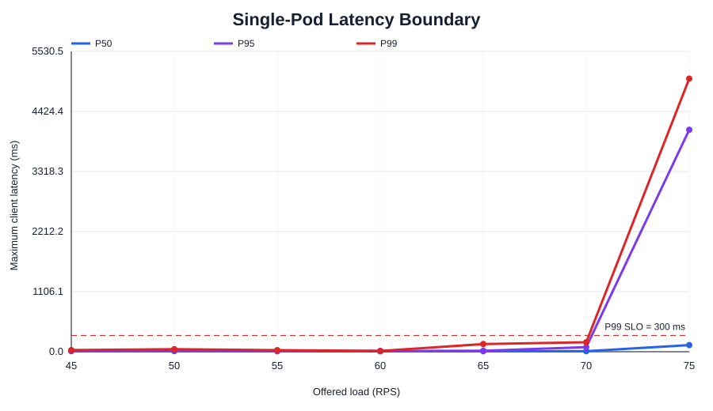
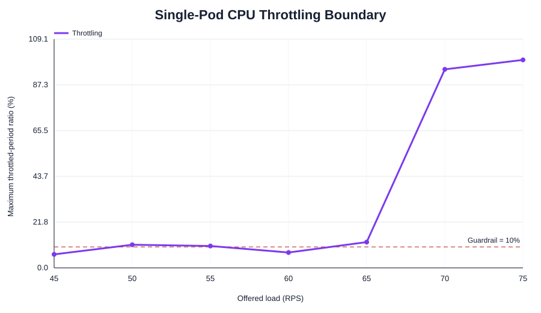
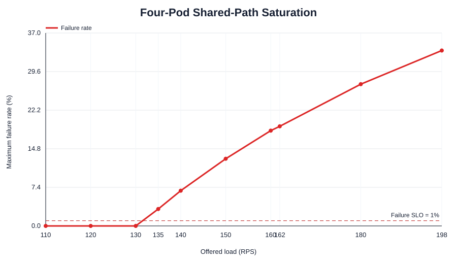
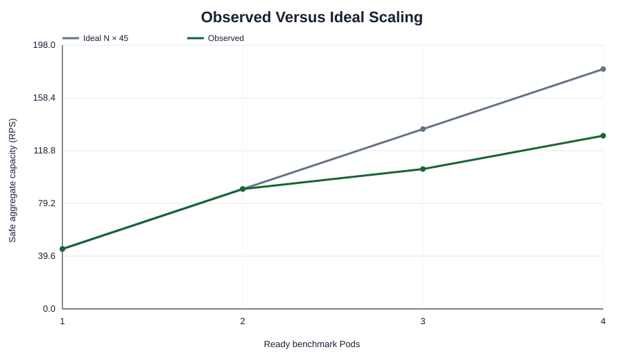

# Step 5 Capacity Profiling Report

## Executive result

Step 5 established the following conservative safe capacities for the recorded
local kind/Docker Desktop development environment:

| Ready Pods | Safe aggregate capacity | Ideal `N × 45` | Scaling efficiency |
|---:|---:|---:|---:|
| 1 | 45 RPS | 45 RPS | 1.000 |
| 2 | 90 RPS | 90 RPS | 1.000 |
| 3 | 105 RPS | 135 RPS | 0.778 |
| 4 | 130 RPS | 180 RPS | 0.722 |

The defensible local single-Pod value is:

`C_pod = 45 RPS`

This is safe capacity, not maximum throughput. It is the highest tested 5-RPS
single-Pod level below the observed boundary that passed every required
repetition and every pre-registered condition.

## SLO and capacity rule

A run passed only when all of the following held:

- client P99 latency `<= 300 ms`;
- client failure rate `< 1%`;
- completed/offered request ratio `>= 99%`;
- mean Pod CPU `<= 90%` of the 500m limit (`<= 450m`);
- CPU throttled-period ratio `< 10%`;
- expected Pod identities served requests; and
- no unexpected readiness, restart, or replica change occurred.

A load level passed only if every required repetition passed. The selected
capacity also had to be monotonic with tested lower levels; isolated lower-load
failures were not discarded.

## Frozen local configuration

- Application image: `anfa/benchmark-app@sha256:0fd880c5401b443a3dfb329c48fe3bd8c844643007a6097f6c31917a47961cee`.
- Work intensity: 50,000 SHA-256 iterations per `/work` request.
- Pod resources: 500m CPU and 128Mi memory, requests equal to limits.
- Kubernetes: three-node `kind-anfa-dev`, with two experiment workers.
- Placement: benchmark Pods only on experiment workers.
- Traffic: open-loop through the external NodePort 30080 development bridge.
- Measurement: 30-second excluded point warm-up, 120-second measured window,
  and 60-second recovery.
- Request timeout: 10 seconds.
- Repetitions: five near the single-Pod boundary; three per multi-Pod condition.
- Point order rotated to reduce time-order and thermal bias.

## Single-Pod profiling

The preliminary sweep located a sharp change between 75 and 100 RPS. Fine and
confirmatory runs then evaluated 45–75 RPS with 5-RPS resolution.

### Selected 45-RPS evidence

| Repetition | Completed | Errors | P99 | Mean CPU | Throttling | Result |
|---:|---:|---:|---:|---:|---:|:---:|
| 1 | 5,400 | 0 | 17.72 ms | 0.285 | 1.81% | pass |
| 2 | 5,400 | 0 | 15.82 ms | 0.308 | 1.42% | pass |
| 3 | 5,400 | 0 | 30.26 ms | 0.322 | 6.43% | pass |
| 4 | 5,400 | 0 | 12.73 ms | 0.280 | 0.00% | pass |
| 5 | 5,400 | 0 | 12.60 ms | 0.282 | 0.00% | pass |

All 27,000 offered requests completed successfully. Maximum observed P99 was
30.26 ms and maximum throttling was 6.43%.

### Why 50 or 60 RPS was not selected

All five 60-RPS runs passed, but the monotonic rule could not accept 60 RPS
because a lower 55-RPS run measured 10.41% throttling. Five new 50-RPS runs were
therefore executed. Four passed, while one measured 11.02% throttling. This was
a marginal resource-guardrail failure, not a latency or request failure, but it
could not be ignored after seeing the data.

The boundary moved to 45 RPS. All five runs passed, so 45 RPS was frozen without
weakening the pre-registered rule.

## Two-Pod validation

Tests were run at 81, 90, and 99 RPS.

- 81 RPS: 3/3 pass.
- 90 RPS: 3/3 pass; zero errors, maximum P99 28.56 ms, maximum per-Pod
  throttling 8.79%, maximum traffic imbalance 3.56%.
- 99 RPS: 1/3 pass; two runs failed the throttling guardrail.

Result:

`C_2 = 90 RPS`, `eta_2 = 90 / (2 × 45) = 1.000`.

## Three-Pod validation

The ideal tests at 122, 135, and 149 RPS showed non-linear behavior:

- 122 RPS completed requests without client failures but every run exceeded the
  throttling guardrail (maximum 12.95–15.31%).
- 135 RPS produced approximately 2.89–3.10% failures.
- 149 RPS produced approximately 11.95–12.19% failures.

Adaptive tests at 110, 115, and 120 RPS still contained throttling failures. A
final boundary test showed:

- 100 RPS: 3/3 pass;
- 105 RPS: 3/3 pass, maximum P99 20.37 ms and maximum throttling 4.42%;
- 110 RPS: only 2/3 pass because one run reached 10.70% throttling.

Result:

`C_3 = 105 RPS`, `eta_3 = 105 / (3 × 45) = 0.778`.

## Four-Pod validation

The ideal linear range failed decisively:

- 162 RPS: approximately 18.97–19.11% failures;
- 180 RPS: approximately 26.81–27.20% failures;
- 198 RPS: approximately 33.25–33.65% failures.

Adaptive tests established:

- 110, 120, and 130 RPS: every run passed;
- 135 RPS: every run failed, with approximately 2.96–3.25% failures;
- 140 RPS: every run failed, with approximately 6.39–6.76% failures;
- 150 and 160 RPS: failure rates increased further.

At 130 RPS, maximum P99 was 30.81 ms, maximum throttling was 5.24%, and all
four Pod identities served traffic. At 135 RPS, successful-request P99 remained
low, but roughly 3% of offered requests failed. Successful-request latency alone
would therefore have been misleading; the failure and throughput rules correctly
rejected the point.

Result:

`C_4 = 130 RPS`, `eta_4 = 130 / (4 × 45) = 0.722`.

## Scaling interpretation

Scaling is linear from one to two Pods, then efficiency falls because all worker
nodes are Docker containers sharing one physical laptop, WSL2 kernel, CPU,
memory system, Docker network, and temporary NodePort/socat bridge.

Above approximately 130 offered RPS, successful throughput repeatedly plateaus
near 131 RPS while added offered traffic appears as failures. At these failed
four-Pod points, per-Pod CPU and successful-request P99 can remain modest. This
strongly indicates a shared local host or request-path ceiling, not a shortage of
benchmark replicas. It is an experimental finding about this local development
environment and must not be generalized to native K3s.

## Capacity formula for the local environment

Because scaling efficiency changes materially with replica count, a single
linear correction factor is not defensible. The controller/oracle should use the
validated lookup table:

| Workload `W` | Required replicas |
|---:|---:|
| `0 < W <= 45` | 1 |
| `45 < W <= 90` | 2 |
| `90 < W <= 105` | 3 |
| `105 < W <= 130` | 4 |
| `W > 130` | outside validated local range |

Formally:

`replicas(W) = min { N in {1,2,3,4} : W <= C_N }`

where:

`C_1=45`, `C_2=90`, `C_3=105`, and `C_4=130` RPS.

For a deliberately conservative approximate formula only, the minimum observed
efficiency is 0.722:

`C(N) ≈ floor(N × 45 × 0.722)`

The lookup table is preferred because that approximation unnecessarily
understates the validated one-, two-, and three-Pod capacities.

## Saturation behavior understood

- Single Pod: throttling becomes the first conservative boundary; latency rises
  sharply at higher offered load and overload eventually produces timeouts.
- Two Pods: near-linear scaling through 90 RPS; throttling becomes inconsistent
  at 99 RPS.
- Three Pods: shared-host and uneven two-worker placement reduce efficiency;
  request failures appear near 135 RPS.
- Four Pods: an external/shared-system throughput plateau near 131 RPS dominates;
  extra offered load becomes failures rather than useful throughput.

## Limitations and transfer rule

These capacities are valid only for the recorded local development topology and
NodePort bridge. They are suitable for component integration and local oracle
logic. Before publishable experiments, the complete Step 5 protocol must be
rerun on the frozen native-K3s environment using its direct request path. The
native-K3s result will replace, not average with, these local constants.

## Artifacts

- `all-classified-runs.csv`: every classified single- and multi-Pod run.
- `aggregate-by-replicas-and-load.csv`: grouped pass/fail and extrema.
- `capacity-result.json`: machine-readable capacity and SLO result.
- `figures/`: latency, throttling, scaling, and four-Pod failure curves.
- `../runs/`: immutable per-run client, Prometheus, and Kubernetes evidence.

## Completion assessment

- Safe single-Pod capacity supported by repeated evidence: complete.
- P50/P95/P99, failures, CPU, throttling, and throughput captured: complete.
- Two-, three-, and four-Pod validation: complete.
- Saturation and non-linear local scaling understood: complete.
- Oracle workload-to-replica mapping defined: complete.
- Native-K3s publishable calibration: intentionally deferred to the final
  experiment environment.

Step 5 is complete for the local development environment.
